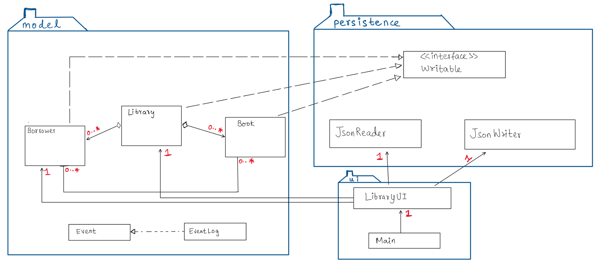

# LIBRARY MANAGEMENT SYSTEM

# OVERVIEW
The Library Management System is a robust Java-based solution that revolutionizes traditional library operations, providing a comprehensive platform for managing 
book transactions, borrower interactions, and administrative tasks. The system is designed to streamline processes, enhance user experience, and bring efficiency 
to library management.

# FEATURES (GRAPHICAL INTERFACE):
BORROWING BOOKS:
Borrowers can easily borrow available books from the library.

RETURNING BOOKS:
Borrowers can return books they have borrowed, ensuring accurate inventory management.

DONATING BOOKS:
Borrowers can contribute to the library by donating books, even if the library already has said book.

DISPLAY INFORMATION ON ALL BOOKS:
Borrowers can choose to display information on all books available in the library.

SAVE STATE:
Borrowers can save the state of a library.

LOAD STATE:
Borrowers can load the last saved state of the library.

# FEATURES (CONSOLE UI):

BORROWING BOOKS:
Borrowers can easily borrow available books from the library.

RETURNING BOOKS:
Borrowers can return books they have borrowed, ensuring accurate inventory management.

PAYING FINES:
Borrowers can pay fines for overdue books, providing a convenient fine payment system.

DONATING BOOKS:
Borrowers can contribute to the library by donating books, even if the library already has said book.

SEARCHING BOOKS:
Borrowers can search to see if a book with a given title is available at the library and whether or not they're available to borrow.

VIEWING ALL BOOKS:
Borrowers can view the complete list of books available in the library.

SAVE STATE:
Borrowers can save the state of a library.

LOAD STATE:
Borrowers can load the last saved state of the library.

# CLASSES (MODEL)
- BOOK CLASS:
  Represents a book with a title, genre, availability, rating, description, etc.
- BORROWER CLASS:
  Represents a borrower with a name , ID, borrowing history, etc.
- LIBRARY CLASS:
  Represents a real life library that can hold books and borrowers and allows borrowers to perform actions such as borrowing, returning, donsting books and much more.

# USER STORIES
- As a user, I want to be able to borrow a book that is available to borrow from the library.
- As a user, I want to be able to return a book that I have borrowed.
- As a user, I want to be able to pay any existing fines on books that I've borrowed in the past.
- As a user, I want to be able to donate a book to the library, even if the library already has that book.
- As a user, I want to be able to view all the books in a library along with their borrowing status.
- As a user, I want to be able to search for a book by its title and know if I can find it at the library and if I can borrow it.
- As a user, I want to be able to save the state of the library
- As a user, I want to be able to load the last state of the library

# INSTRUCTIONS FOR GRADER:
- You can generate the first required action related to the user story "adding multiple Xs to a Y" by clicking "Donate a book" on the GUI and filling in the book's fields (title, author's name, genre & description). This allows you to donate a book to the library.
- You can generate the second required action related to the user story "adding multiple Xs to a Y" by clicking "Display information on all books", this will display info on all books in the library.
- You can generate the third required action related to the user story "adding multiple Xs to a Y" by clicking "Borrow a book" on the GUI and entering the title in the text field that appears, this will allow you to "borrow" the book (if it exists) from the library.
- You can locate my visual component by clicking "Donate a book" on the GUI and filling in the book's fields (title, author's name, genre & description), after a which, a thank you GIF pops up.
- You can save the state of my application by clicking the save library button on the GUI.
- You can reload the last saved state of my application by clicking the load library button on the GUI.

# PHASE 4: TASK 2
Event Log:
Sun Apr 07 23:37:09 PDT 2024
Added Book:gvtgv

Sun Apr 07 23:37:28 PDT 2024
Borrowed Book:Book5

Sun Apr 07 23:37:32 PDT 2024
Showed information on all books

# PHASE 4: TASK 3

If I had more time to work on the project, I would add a BookManager and a Borrower Manager class in the model package of the main folder.

BorrowerManager Class:

This class will handle operations related to managing borrowers, such as adding new borrowers, removing existing ones, searching for borrowers by ID, and handling borrowing/returning books.
It can include methods like addBorrower, removeBorrower, getBorrowerByID, etc.
The BorrowerManager class can interact with the Library class to perform these operations.
Similar to BookManager, the Library class will interact with the BorrowerManager for borrower-related operations. Methods like addBorrower, removeBorrower, getBorrowerByID, will be invoked on the BorrowerManager instance.
By introducing BorrowerManager, the Library class abstracts away the complexities of borrower management. It enhances code readability and maintainability by segregating borrower-related functionalities into a separate class, promoting better code organization and reducing code duplication.

BookManager Class:

The BookManager class will handle operations related to managing books, such as adding new books, removing books, searching for books by title or author, and updating book information.
Methods like addBook, removeBook, searchBookByTitle, showAvailableBooks, etc. can be included in this class.
Similar to the BorrowerManager, the BookManager class should interact with the Library class to perform these operations. For example, when adding a book, instead of directly manipulating the ArrayList of books within Library, the Library class will call the addBook method of the BookManager.
This separation of concerns will ensure that the Library class focuses on high-level library operations and delegates specific book management tasks to the BookManager.

# REFERENCES
Workroom.java - Paul Carter (CPSC 210 (Project - PHASE 2))
AlarmSystem.java (CPSC210 Project Phase 4: Event Logging)
